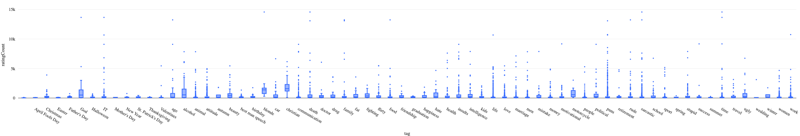
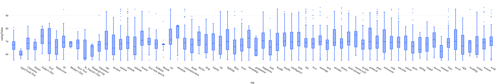

# Databricks ETL Project

##  Project Overview
The purpose of this project is to use Auto Loader to ingest data (in this case, 4k+ jokes dataset stored in JSON format files) from cloud object storage, process them using Spark and then loads the data into Delta table. By using the Delta table, we can query the data using SQL and visualize the data. With the visualization, we can see the distribution of the rating count and rating value of the jokes for different tags, and draw conclusions from the visualization.

## Project Files
* `README.md` - This file.
* `etl_databricks_jokes.py` - The main ETL script to process the data.

## Datasets
* `dbfs:/FileStore/shared_uploads/mz246@duke.edu/jokes/*.json` - The dataset contains the jokes data in cloud object storage.

## How to Run
1. Create a Databricks cluster with the following configuration:
* Databricks Runtime Version: 13.3 LTS (includes Apache Spark 3.4.1, Scala 2.12)
* Python Version: Python 3
* Enable Autoscaling: True
* Terminate after: 20 minutes
* Worker Type: Standard_DS3_v2
* Minimum Workers: 1
* Maximum Workers: 8
* Auto Termination: True
* Auto Termination Minutes: 20
2. Create a Databricks notebook and paste the code from etl_databricks_jokes.py into it.
3. Run the notebook.

## Data Pipeline
1. Ingest data from cloud object storage using Auto Loader. The Auto Loader automatically detects the schema of the data and stores it in the checkpoint location. The schema is then used to read the data from the cloud object storage. The Auto Loader also automatically detects new files as they arrive in the cloud object storage and processes them. The Auto Loader is configured to ingest JSON data to a Delta table.

```python
...
# Configure Auto Loader to ingest JSON data to a Delta table

    spark.readStream.format("cloudFiles")  # use Auto Loader
    .option("cloudFiles.format", "json")  # read JSON files
    .option(
        "cloudFiles.schemaLocation", checkpoint_path
    )  # use checkpoint location to store schema
    .load(file_location)  # read files from file_location
...
```
2. Process the data using Spark. The processing includes:
* Cast ratingCount to integer
* Cast ratingValue to double
* Explode tags into separate rows for each tag
* Extract tag from tag_raw
* Add source file name from metadata
* Add processing time
* Drop tag_raw column which is no longer needed
```python
...
.withColumn(
        "ratingCount", col("ratingCount").cast(IntegerType())
    )  # cast ratingCount to integer
    .withColumn(
        "ratingValue", col("ratingValue").cast(DoubleType())
    )  # cast ratingValue to double
    .select(
        "*", explode(split(col("tags"), ",")).alias("tag_raw")
    )  # explode tags into separate rows for each tag
    .withColumn(
        "tag", regexp_extract(col("tag_raw"), '\\"(.*)\\"', 1)
    )  # extract tag from tag_raw
    .select(
        "*",
        col("_metadata.file_path").alias(
            "source_file"
        ),  # add source file name from metadata
        current_timestamp().alias("processing_time"),  # add processing time
    )
    .drop("tag_raw")  # drop tag_raw column which is no longer needed
...
```
3. Load the data into Delta table. Trigger the stream to process files as soon as they appear. Use checkpoint location to avoid reprocessing files.
```python
...
    .writeStream.option(
        "checkpointLocation", checkpoint_path
    )  # checkpoint to avoid reprocessing files
    .trigger(availableNow=True)  # process files as soon as they appear
    .toTable(table_name)  # write to Delta table
...
```
4. Validate the data quality by looking for null values and negative values in ratingCount and ratingValue columns.
```python
# Data validation checks
assert df.filter(df.ratingCount.isNull()).count() == 0, "Null values found in ratingCount"
assert df.filter(df.ratingValue.isNull()).count() == 0, "Null values found in ratingValue"
assert df.filter(df.ratingValue < 0).count() == 0, "Negative values found in ratingValue"
assert df.filter(df.ratingCount < 0).count() == 0, "Negative values found in ratingCount"
```
5. Visualize the data using Databricks notebook. The visualization includes two plots:
* Joke rating count plot: the distribution of the rating count of the jokes for different tags.



* Joke rating value plot: the distribution of the rating value of the jokes for different tags.



## Conclusion
1. As displayed in the joke rating count plot, the distribution of the rating count of the jokes for different tags are not the same. `God`, `alcohol`, `blond`, `Christian`, `motocycle` topics have the highest rating count.
2. As displayed in the joke rating value plot, the distribution of the rating value of the jokes for different tags are not the same. `Father's day`, `Christian`, `friendship`, `motocycle`, `success` topics have the highest rating value.

## Future Work
We can explore more jokes sample dataset to create a topic or tag list that are more likely to have higher rating count and rating value. Generating humor is a complex task in the domain of machine learning, and it requires the models to understand the deep semantic meaning of a joke in order to generate new ones. When generating jokes, if we targeting the joke topics that are more likely to have higher rating count and rating value, we might be able to generate better jokes.